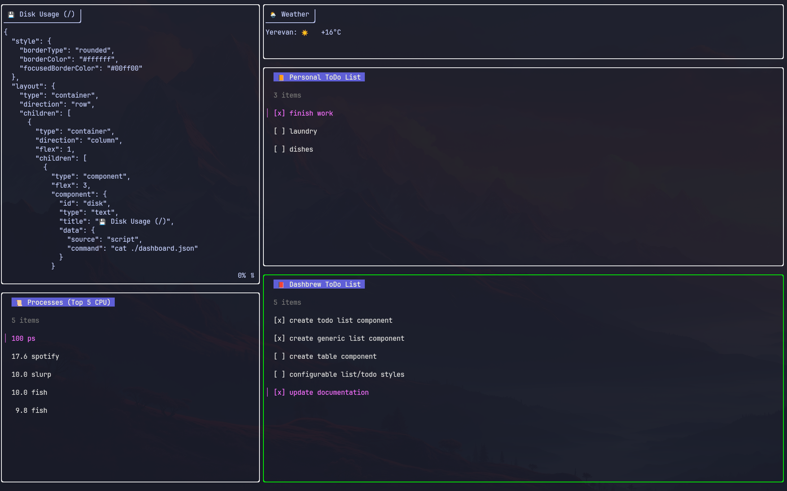

# Dashbrew  brews your terminal dashboard! 🧉

```
       /$$                     /$$       /$$                                        
      | $$                    | $$      | $$                                        
  /$$$$$$$  /$$$$$$   /$$$$$$$| $$$$$$$ | $$$$$$$   /$$$$$$   /$$$$$$  /$$  /$$  /$$
 /$$__  $$ |____  $$ /$$_____/| $$__  $$| $$__  $$ /$$__  $$ /$$__  $$| $$ | $$ | $$
| $$  | $$  /$$$$$$$|  $$$$$$ | $$  \ $$| $$  \ $$| $$  \__/| $$$$$$$$| $$ | $$ | $$
| $$  | $$ /$$__  $$ \____  $$| $$  | $$| $$  | $$| $$      | $$_____/| $$ | $$ | $$
|  $$$$$$$|  $$$$$$$ /$$$$$$$/| $$  | $$| $$$$$$$/| $$      |  $$$$$$$|  $$$$$/$$$$/
 \_______/ \_______/|_______/ |__/  |__/|_______/ |__/       \_______/ \_____/\___/ 
```

**Dashbrew** is a terminal dashboard builder that lets you visualize data from scripts and APIs right in your console, using a simple JSON configuration. Stay informed without leaving your terminal!



---

## ✨ Features

*   **Configurable Layout:** Define complex dashboard layouts (rows, columns, flexible sizing)
*   **Multiple Data Sources:**
    *   `script`: Execute local shell commands/scripts and display their output.
    *   `api`: Fetch data from HTTP APIs and display the response body.
*   **Terminal UI:** Built with the delightful [Bubble Tea](https://github.com/charmbracelet/bubbletea) framework.
*   **Navigation:** Easily move focus between components using arrow keys, `hjkl`, or your mouse.
*   **Scrolling:** Scroll through component content that doesn't fit using the mouse wheel or `h`/`j`.
*   **Text Wrapping:** Long lines within components are automatically wrapped to fit the component's width.
*   **Auto-Refresh:** Configure components to automatically refresh their data at specified intervals.
*   **Visual Focus Indicator:** Clearly see which component is currently selected.

---

## ⚙️ Configuration (`dashboard.json`)

Dashbrew uses a `json` file in to define the layout and components.

**Structure:**

```jsonc
{
  "layout": {
    "type": "container", // "container" or "component"
    "direction": "row",  // "row" or "column" (for containers)
    "flex": 1,           // Optional: Relative size factor (default: 1)
    "children": [ ], // Array of child layout nodes (for containers)
    "component": { } // Component definition (for components)
  }
}
```

### Layout Nodes:

- `type`: Can be "container" or "component".
- `direction`: (Only for container) How children are arranged ("row" or "column").
- `flex`: (Optional) An integer determining how space is distributed among siblings. A component with flex: 2 will try to be twice as large (in the container's direction) as a sibling with flex: 1. Defaults to 1.
- `children`: (Only for container) An array of nested layout nodes.
- `component`: (Only for component) Defines the actual widget to display.

### Component Definition:

**Structure:**
```jsonc
{
  "id": "unique-component-id", // Optional: A unique ID. If omitted, an internal ID is generated.
  "type": "text",             // Currently only "text" is supported
  "title": "My Component Title",
  "data": {
    "source": "script", // "script" or "api"
    "command": "date +%Y-%m-%d", // Required if source is "script"
    "url": "https://api.example.com/status", // Required if source is "api"
    "refresh_interval": 5 // Optional: Refresh data every 5 seconds. Omit or 0 for no auto-refresh.
  }
}
```


- `id`: (Optional) A unique ID. If omitted, an internal ID is generated.
- `type`: The type of widget. Currently, only "text" is implemented (displays text content with scrolling).
- `title`: The title displayed in the component's header.
- `data`: Defines where the component gets its content.
    - `source`: "script" or "api".
    - `command`: (For script source) The command to execute.
    - `url`: (For api source) The URL to fetch via HTTP GET.
    - `refresh_interval`: (Optional) Time in seconds between data refreshes.


## 🚀 Installation & Usage (will be changed)

1. Clone the repository:

```bash
git clone https://github.com/rasjonell/dashbrew.git # Replace with actual repo URL
cd dashbrew
```

2. Build the binary:

```bash
go build -o dashbrew ./cmd/dashbrew
```

3. Create your `dashboard.json`

4. Run:

```bash
./dashbrew
```

## ⌨️ Keybindings

- Navigation:
    - `shift + ↑` / `shifht + K` - Move Up
    - `shift + ↓` / `shift + J` - Move Down
    - `shift + ←` / `shift + H` - Move Left
    - `shift + →` / `shift + L` - Move Right
    - `Left Click` - Focus Component Under Cursor
- Focused Componet Actions:
    - Mouse Wheel - Scroll
    - `PgUp` / `b` / `u` - Scroll up.
    - `PgDown` / `Space` / `d` - Scroll down.
    - `r` - Refresh Data Source 
- Quit: `Ctrl+C`, `q`, `Esc`

### 💡 Future Ideas

- More component types (charts, gauges, lists).
- More data sources
- Data parsing/transformation (e.g., extracting values from JSON).
- Customizable themes/colors.
