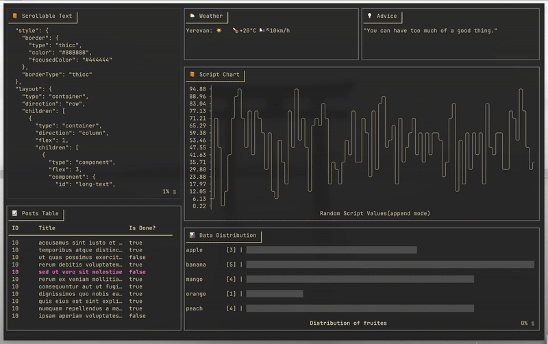

```
       /$$                     /$$       /$$                                        
      | $$                    | $$      | $$                                        
  /$$$$$$$  /$$$$$$   /$$$$$$$| $$$$$$$ | $$$$$$$   /$$$$$$   /$$$$$$  /$$  /$$  /$$
 /$$__  $$ |____  $$ /$$_____/| $$__  $$| $$__  $$ /$$__  $$ /$$__  $$| $$ | $$ | $$
| $$  | $$  /$$$$$$$|  $$$$$$ | $$  \ $$| $$  \ $$| $$  \__/| $$$$$$$$| $$ | $$ | $$
| $$  | $$ /$$__  $$ \____  $$| $$  | $$| $$  | $$| $$      | $$_____/| $$ | $$ | $$
|  $$$$$$$|  $$$$$$$ /$$$$$$$/| $$  | $$| $$$$$$$/| $$      |  $$$$$$$|  $$$$$/$$$$/
 \_______/ \_______/|_______/ |__/  |__/|_______/ |__/       \_______/ \_____/\___/ 
```

**Dashbrew** is a terminal dashboard builder that lets you visualize data from scripts and APIs right in your console, using a simple JSON configuration. Stay informed without leaving your terminal!



## 🚀 Installation

### Using Go Install

```bash
go install github.com/rasjonell/dashbrew/cmd/dashbrew@latest
```

### From Source

```bash
# Clone the repository
git clone https://github.com/rasjonell/dashbrew.git
cd dashbrew

# Build and install
go install ./cmd/dashbrew
```

## Quick Start

1. Create a simple dashboard configuration file(`dashboard.json`):
```jsonc
{
  "style": {
    "border": {
      "type": "thicc",
      "color": "#cccccc",
      "focusedColor": "#474747"
    }
  },
  "layout": {
    "type": "container",
    "direction": "row",
    "children": [
      {
        "type": "component",
        "flex": 1,
        "component": {
          "type": "text",
          "title": "Hello Dashbrew",
          "data": {
            "source": "script",
            "command": "echo 'Welcome to Dashbrew!'"
          }
        }
      }
    ]
  }
}
```

2. run:

```bash
dashbrew -c dashboard.json
```

## Complete Documentation

For comprehensive documentation on all features, please refer to our [GitHub Wiki](https://github.com/rasjonell/dashbrew/wiki):

- [Layout System](https://github.com/rasjonell/dashbrew/wiki/https://github.com/rasjonell/dashbrew/wiki/Layout-System)
- [Components](https://github.com/rasjonell/dashbrew/wiki/Components)
- [Styling Options](https://github.com/rasjonell/dashbrew/wiki/Styling-Options)

## Basic Examples

### Display API Data

Show real-time data from an API:

```jsonc
{
  "type": "component",
  "component": {
    "type": "text",
    "title": "🌦️ Weather",
    "data": {
      "source": "api",
      "url": "https://wttr.in/<YOUR_CITY>?format=4",
      "refresh_interval": 60
    }
  }
}
```

### Creating a ToDo List

Create a `todo.txt` file:

```
- finish work
+ laundry
+ dishes
```

Add it to your dashboard:

```jsonc
{
  "type": "component",
  "component": {
    "type": "todo",
    "title": "📋 My Todo List",
    "data": {
      "source": "./todo.txt"
    }
  }
}
```

### Creating a Chart

Visualize Data with charts:

```jsonc
{
  "type": "component",
  "component": {
    "type": "chart",
    "title": "📊 System Metrics",
    "data": {
      "source": "script",
      "command": "echo '10\n25\n15\n30\n45'",
      "refresh_interval": 5,
      "caption": "CPU Usage (%)"
    }
  }
}
```

### Create a Histogram

Show distributions with histograms:

```jsonc
{
  "type": "component",
  "component": {
    "type": "histogram",
    "title": "📊 Age Distribution",
    "data": {
      "source": "script",
      "command": "echo '\"18-24\": 45\n\"25-34\": 78\n\"35-44\": 52\n\"45-54\": 34\n\"55+\": 21'",
      "caption": "Users by Age Group"
    }
  }
}
```

## Basic Navigation

- `Shift+Arrow` or `Shift` + `H/J/K/L`: Move between components
- `A`: Add item (in todo lists)
- `Space`: Toggle item state (in todo lists)
- `R`: Refresh data for the focused component
- `Ctrl+C`: Quit

## License

[MIT License](./LICENSE)
